# Consistent Hashing

---

# Overview

- Rehashing Problem (modular hash)
- Consistent Hashing

<!--
Consistent Hashing のことを話す前に Consistent Hashing を用いない場合の分散環境におけるデータ管理の問題を話したいと思います。
その後、課題を解決する Consistent Hashing の話に移っていきます
分散ストレージや負荷分散などで役に立っているアルゴリズム？になってます
-->

--- 

## Cache Servers

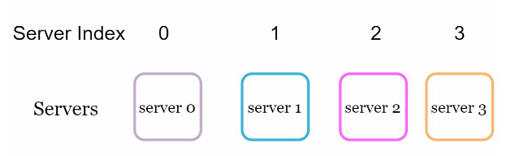

<!--
複数の Cache Server に分散してデータを預けてアクセスするとします

-->

---

# 

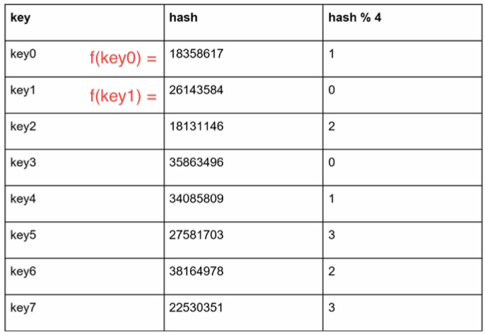

---

# 

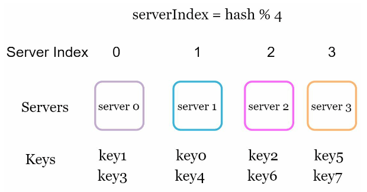

---

# Server1 が Offline になったとき

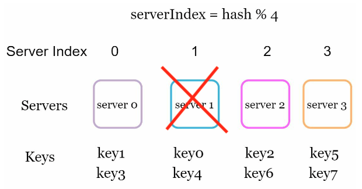

---

# 

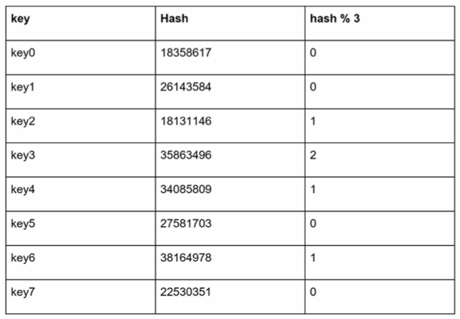

---

# 

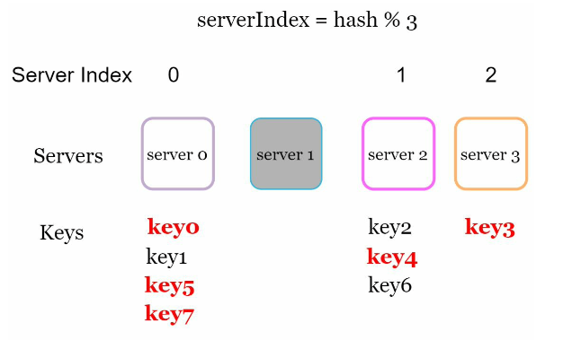

<!-- -->

--- 

# Problem

データ量が多いと再配置に時間がかかる
データの偏りが生じる

<!-- 
modular hash のような従来の hash table における分散数の変化はほぼすべてのキーの置き換えが起こる
-->

---

# 理想

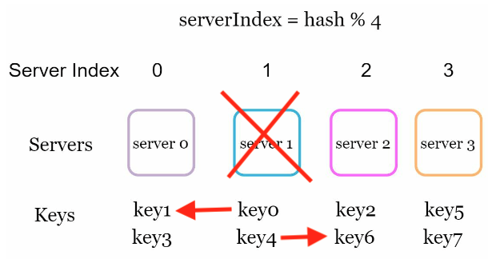

<!-- 
できれば再配置の移動は最小限にしたい
それに近いものが実装できるのが Consistent Hashing
-->

---

# 実装

f: hash 関数
x0, x1 ... xn: 出力範囲

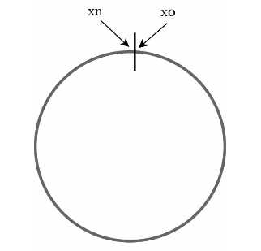

- https://github.com/Cyan4973/xxHash など軽量なものがオススメ

<!-- 
uint64 を吐き出すような hash 関数など
-->

---

# 

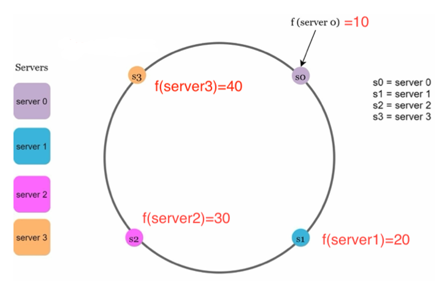

---

# 

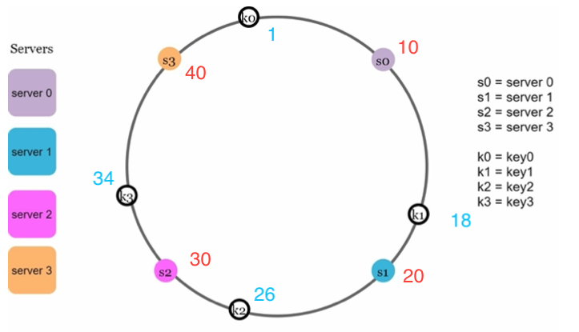

---

# 

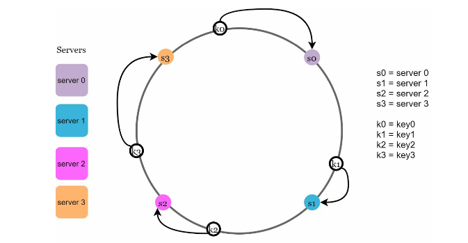

---

# 

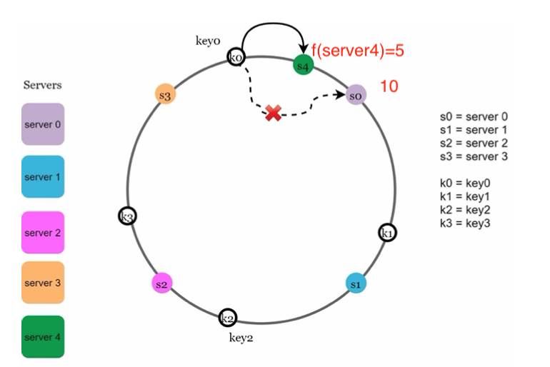

---

# 

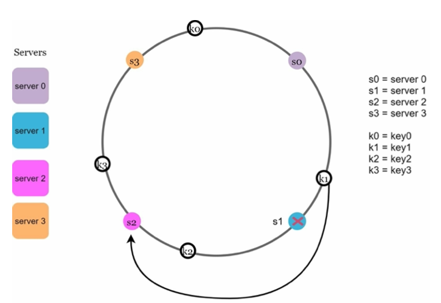

---

# 

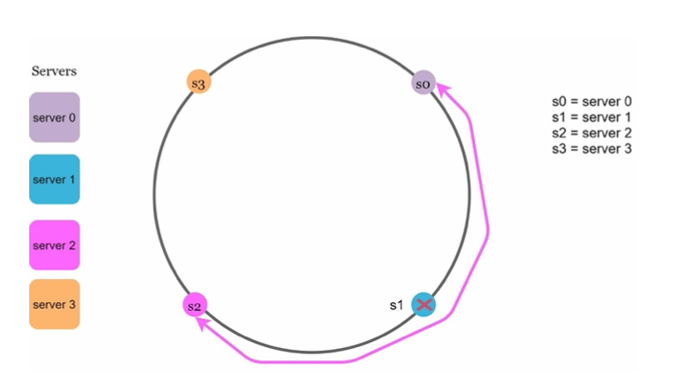

---

# 

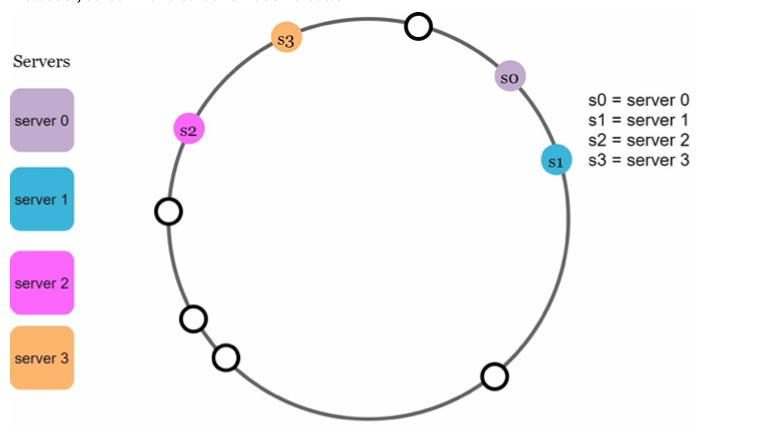

---

# 

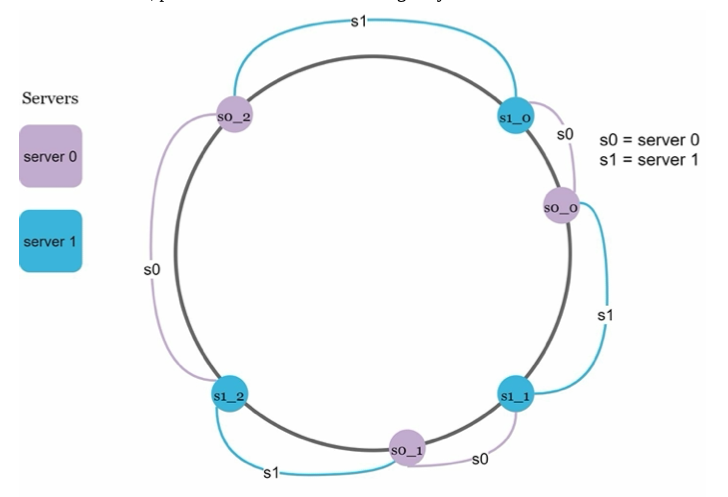

---

# 

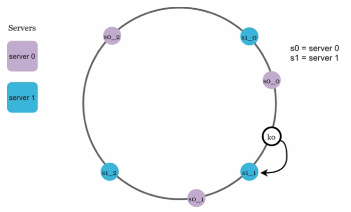

---

# Pros

- ノードが増減した場合に、影響を受けるキーの範囲が限定される
- データの移動が局所的で済む

---

# Cons

- Node の状態を知っている何かしらは必要
- DB の場合、Node の追加・削除時のデータ配分のロジックが必要(複雑)

---

# 具体的なコード例

https://github.com/golang/groupcache/blob/master/consistenthash/consistenthash.go
sort.Search が便利

---

# sort.Search

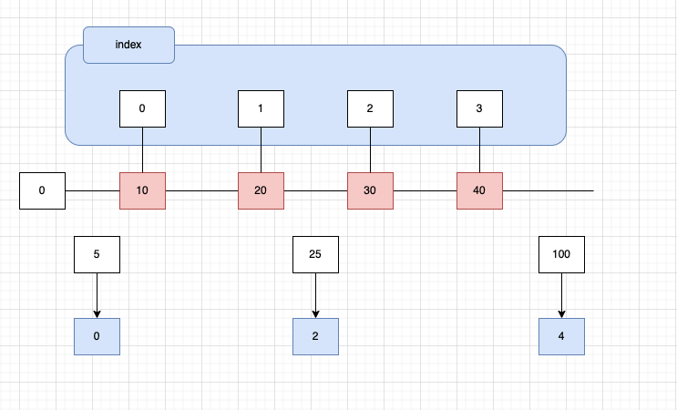

---

# 参考

- [Consistent Hashing: Algorithmic Tradeoffs](https://dgryski.medium.com/consistent-hashing-algorithmic-tradeoffs-ef6b8e2fcae8)
- [System Design Interview – An insider's guide](https://www.amazon.co.jp/System-Design-Interview-Insiders-English-ebook/dp/B08B3FWYBX/ref=sr_1_2?__mk_ja_JP=%E3%82%AB%E3%82%BF%E3%82%AB%E3%83%8A&keywords=System+Design+Interview&qid=1652182068&sr=8-2)

---

# 発展

- [HOW DISCORD SCALED ELIXIR TO 5,000,000 CONCURRENT USERS](https://discord.com/blog/how-discord-scaled-elixir-to-5-000-000-concurrent-users)
- [Shuffle Sharding](https://aws.amazon.com/jp/builders-library/workload-isolation-using-shuffle-sharding/)
- [libketama](https://www.last.fm/user/RJ/journal/2007/04/10/rz_libketama_-_a_consistent_hashing_algo_for_memcache_clients)
  - memcached のクライアントライブラリ
    - 今使っているか調べていない
- [もう少し実世界よりの実装例](https://github.com/buraksezer/consistent)
  - node の削除に対応している