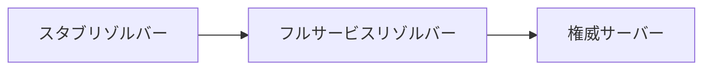
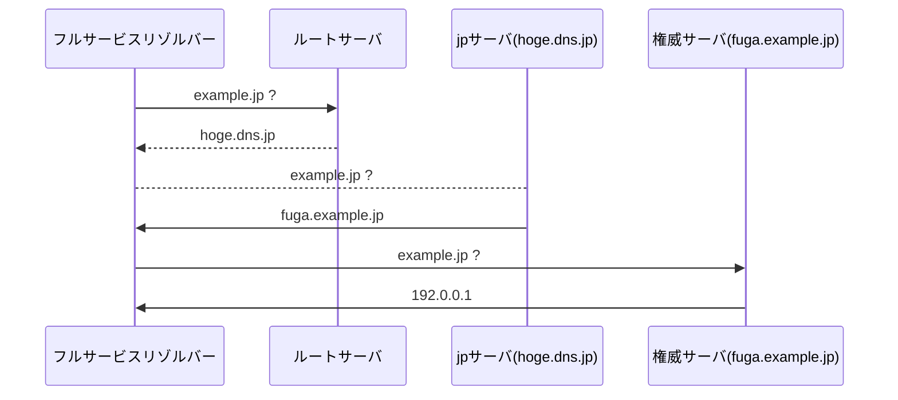

DNSがよくわかる教科書 を読んで学んだことを残しておく  
該当章を読んで頭の中にあることを書いているので間違っているかも知れない

### レジストリ

該当ゾーンのドメイン名を管理する責務を持つ。ゾーンとは、jp などのドメイン名。  
階層構造でレジストリは存在し、名前解決のときに下のゾーンの情報のみ知るようになっている。  
例えば、すべてのリクエストは .(ルート) から始まり、そのレジストリは、リクエストによって、その下の jp や com などの ネームサーバの場所を教える

### レジストラ

顧客がドメインを持つためにレジストリとやりとりするための仲介を行う。  
レジストラは、ドメインに対して複数存在し、顧客がレジストラを選ぶとこができる。  
これは、ビジネス上独占させないように競合をあえて許している。  
また、レジストラは一般的に顧客が得たドメインとその宛先IPを登録するネームサーバも提供している。そもそもこれがないとドメイン名を得ただけでは名前解決の際にどこのサーバにリクエストを送ればいいかわからない。

### TTL

名前解決の際に都度都度ネームサーバを順繰りに辿るのは負荷が高いので、サーバ側で一定時間キャッシュさせ、宛先情報を即座に引っ張ることができるようになっている。後述のフルサービスリゾルバは、問い合わせしたURLに対するリソースがない場合もキャッシュする。これはネガティブキャッシュと呼ばれる。

### 名前解決について

情報が欲しい人 = スタブリゾルバー  
情報が欲しい人からの依頼を受けて、名前解決する人 = フルサービスリゾルバー  
情報を提供する人 = 権威サーバー

フルサービスリゾルバーは権威サーバに対して再帰的に情報をリクエストして名前解決を行い切る
ちなみに、フルサービスリゾルバはルートサーバの情報を持っているから最初の一発目のリクエストが行える。

