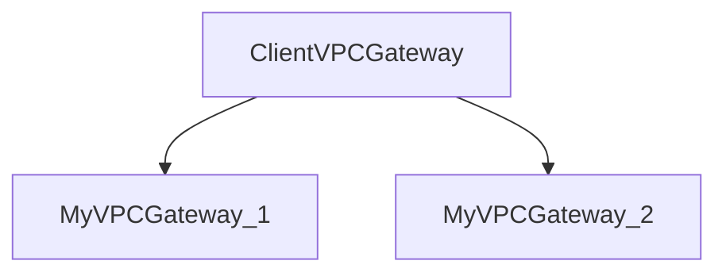
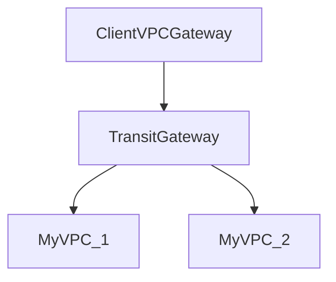

### IPSec VPN

IPSec VPN に対応したルータ同士で接続する  
クライアントPC には VPN ソフトウェアが必要  
OSI 参照モデルで言うネットワーク層以上のデータが暗号化される  

### SSL VPN

SSL VPN Gateway にアクセスさせて、そこから後段のサーバにリバースプロキシさせる手法がある  
そのため、GateWay には認証機能が必ずある。  
Gateway へは Internet からアクセス可能なので。  
あまり通常の認証ありのアプリケーションとの違いがわからない。  
必ずSSL通信が対象の Gateway とやりとりされるというのがメリット?

### P2PE

P2PE サーバというクレジットカードの情報を復号化する機能をもったものとやりとりすることで  
端末での復号化を防ぎ、セキュリティを担保する仕組み。  
カード情報を端末や店舗側に残さない(暗号化されてやりとりされるため)

### AWS Transit Gateway

TransitGateway 使わないとき

TransitGateway 使えるとき

メリット
ClientGatewayや、MyVPCGateway が増えたときの管理が楽  
TransitGatewayに設定追加すればよいので

### BGP

### Route 53

**エイリアスレコード**
AWS のリソースにトラフィックをトラフィックをルーティングさせることができる。  
Zone Apex(example.com といったドメイン名)と同様にレコードを作れる  
CNAME でできない同一ドメインに対しては設定できない & ELBなどに設定したいときにIPアドレスが可変になってしまうを解決できる  

### 参考

- [AWS <-> 顧客間との接続方法](https://docs.aws.amazon.com/whitepapers/latest/aws-vpc-connectivity-options/network-to-amazon-vpc-connectivity-options.html)
- [CNAMEレコードにZone Apexをマッピングできない件について](https://blog.serverworks.co.jp/tech/2016/07/07/zone-apex-cname/)