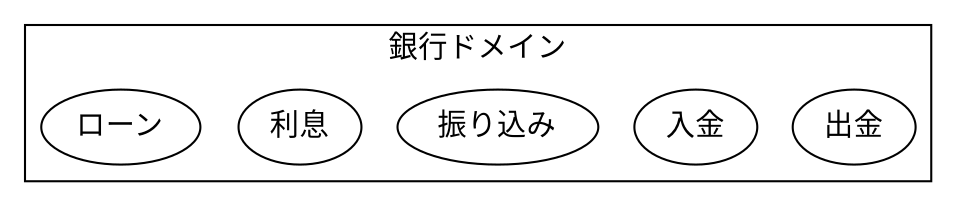

### ドメイン

この世界についての何か
ソフトウェアに関連する人たちで合意した定義された概念

### ドメインモデル

業務や課題を解決する概念の範囲  
動作とデータの両方を組み込んだもの。こうすることで、ドメインモデルのもつ振る舞いが外に出ない。  

### エンティティ

ID などで一意に識別できるオブジェクト  
エンティティの ID は複数のマイクロサービスまたは有界コンテキストを横断できる  
外部のフレームワークやライブラリに依存しない  
データ永続化の詳細を完全に無視する  

### ドメインモデルレイヤー

ビジネス状況を反映する状態はここで制御、使用される。ただし、保管の処理のような技術的な詳細はインフラストラクチャに委譲する。  

### アプリケーションレイヤー

ソフトウェアが実行するはずのジョブが定義されており、ドメインオブジェクトに指示を行うレイヤ。故に、このレイヤはビジネスルールもナレッジも含まない。あくまでドメインオブジェクトに指示をだしてジョブを実行することに責務を持つ。  
このレイヤの進行状況を反映する状態を持つことはできる。  

### アプリケーションサービス

ドメインモデル自体で持つには不自然になってしまった処理を実装する。むやみにこれを使うようになるとドメインモデルから振る舞いが失われるので極力つかわない方針にするのがよい。ドメインモデルのバリューオブジェクト化を防ぐため。  

例としては、ドメイン自身があるドメインのデータを取得したいといった要件があるときはサービスにその処理を移管する

### アグリゲート

永続性の基本単位。エンティティのコレクションの場合もある。  
最上位のエンティティはアグリゲートルートと呼ぶ  

アグリゲートの一部が更新されると、そのアグリゲート内部では整合性を保つために他の部分も更新する。例えば ID など。  

トランザクションの単位と考えればいい。そう考えることで、一部のエンティティのみ更新する処理が散乱せずに済む。  
Read も基本的に集約単位でとってしまうのが楽。これをパフォーマンスのために読み込みモデルを作って取得するのが CQRS と呼ばれる。(読み取りデータモデルを定義する)  
集約パターンで複雑になったモデルの取得を緩和することができる。そのため、DDD パターンは Tx の範囲のみで用いることもあり。  

### 参考

- https://docs.microsoft.com/ja-jp/dotnet/architecture/microservices/microservice-ddd-cqrs-patterns/ddd-oriented-microservice