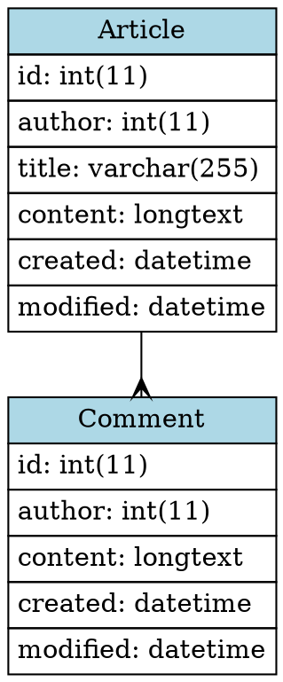

### ドメインモデリングの方法

**なぜやるか**

コードを書く開発前に考慮漏れがないようにする

**どうやるか**

実装するソフトウェアの対象領域に詳しい人間を呼んでアウトプットのイメージをすり合わせる  
開発者の足りない知識を埋め合わせる  

**ドメインモデル図**

簡易なクラス図程度のものでよい

- オブジェクトの代表的なフィールドを書く
- オブジェクト動詞の has-a 関係、参照関係を表現する
- ルール/制約を吹き出しに書き出す
- 集約の範囲を定義する

### 今回の対象

面接管理システム

