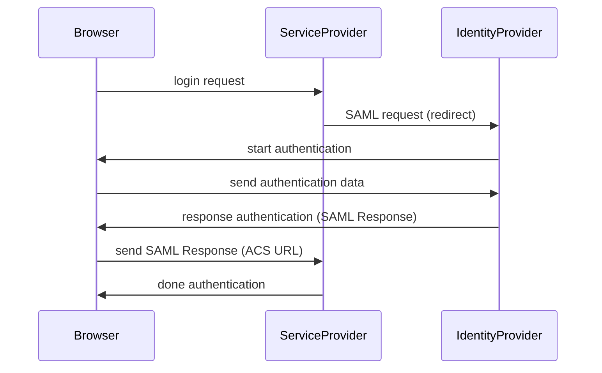
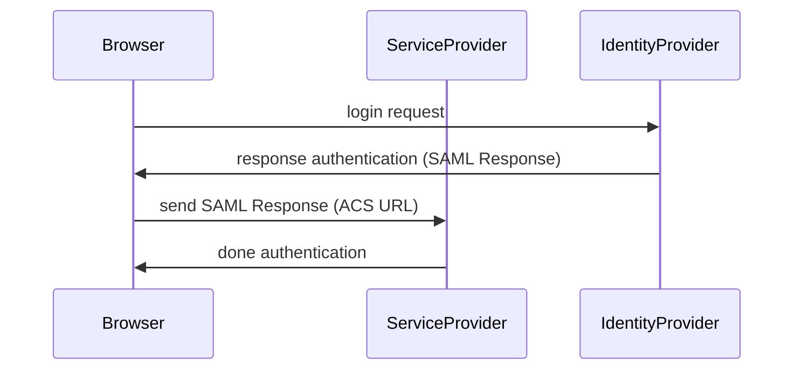

以下読んだときのメモ

- [SAML入門](https://techbookfest.org/product/5255165663772672?productVariantID=5142951254556672)

### What is SAML

`認証` プロトコル。SSO 実現に利用できる。

### Why use SAML

SSO によるメリットを主に享受できる

- 入退社時のアカウント運用
- 対象アカウントの情報更新

これらを扱う場所を一つにすることで、ID に関するイベントを他のサービスで扱わなくて済むようになる。管理コストの軽減。

### Architecture

**登場人物**

- User Agent
  - ブラウザやモバイルアプリなど
- Service Provider (SP)
  - 認証情報を利用する側、SaaS 事業者などが当てはまる
- Identity Provider (IdP)
  - 認証情報を発行する側
    - Okta など

**認証シーケンス**

SP-initiated  

Service Provider からログインを行おうとした場合

IdP-initiated

Identity Provider 側から Service Provider にアクセスしたときの場合。例えば、利用できる SaaS 一覧から対象 SaaS にアクセスするときなど。  

各フローとも、IdP での認証成功時、SAML Assertion が生成される。これは、IdP で署名された認証情報(署名するかは Optional)。

### ジャストインタイムプロビジョニング

SAML認証成功時に NameID に紐づくリソースが SP 側にないときに生成も行うこと。  
SAML 認証ユーザは誰でも SP に入れるようになってしまうので、Optional でユーザが利用するか選べるようにしとくのが無難。  

### 所感

**SP 側で注意したいこと**

SP 側と IdP で認証に成功したら何らかのアクセスキーを発行することが多いと思う。SP 側から JWT 発行など。

NameID は persistent でもらい、email などほしければ Attribute でもらうのがよさそう  
format は以下のように指定できる  

- urn:oasis:names:tc:SAML:1.1:nameid-format:unspecified
  - おまかせ
- urn:oasis:names:tc:SAML:1.1:nameid-format:emailAddress
- urn:oasis:names:tc:SAML:2.0:nameid-format:persistent
  - IdP と SP で一対のランダムな永続的な識別子。何度発行しても同じアカウントに対しては同じ識別子で返ってくる。

なぜなら、仮に emailAddress で SP でのデータやりとりしていたときには、アドレスが使い回されたときに検知することができないから。  
たとえば A さんが `a@gmail.com` を使っていて、退職。万が一次の A' さんに `a@gmail.com` が与えられた場合、NameID は同じなので SP が email を ID 代わりにしていた場合は A さんとしてログインすることになってしまう。  
使いまわしなんて滅多にないケースだけれど SAML で認証してくるユーザのユニーク性を担保するのであれば persistent で ID を受け取って SP 側で紐付けるのが正しいように思える。IdP 側でのメールアドレス変更にも弱い。  

### 参考

- [saml-profiles-2.0](https://docs.oasis-open.org/security/saml/v2.0/saml-profiles-2.0-os.pdf)