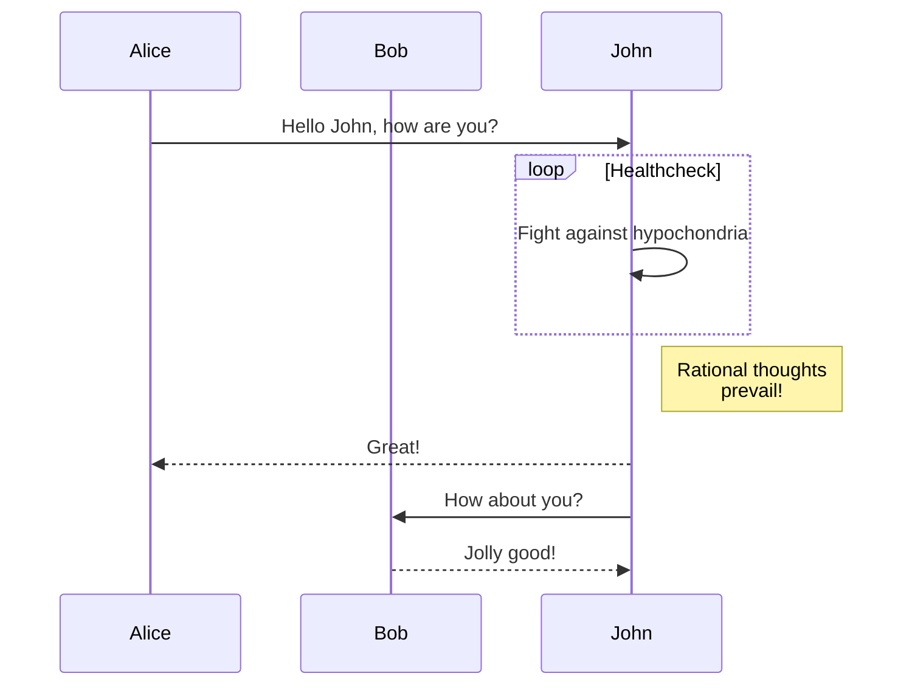
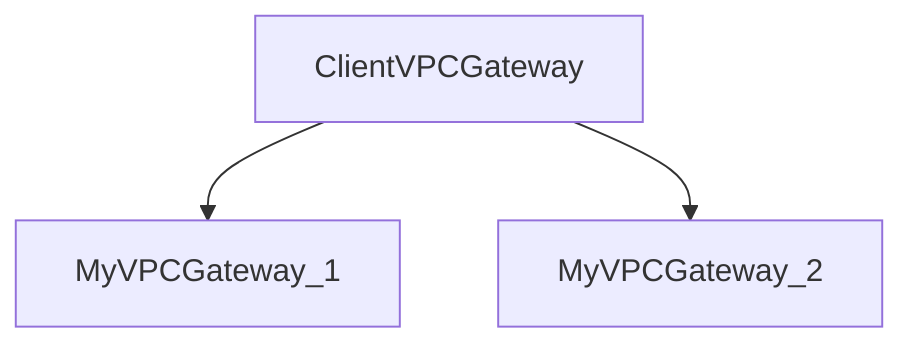

以下読んだときのメモ

- [SAML入門](https://techbookfest.org/product/5255165663772672?productVariantID=5142951254556672)

### What is SAML

`認証` プロトコル。SSO 実現に利用できる。

### Why use SAML

SSO によるメリットを主に享受できる

- 入退社時のアカウント運用
- 対象アカウントの情報更新

これらを扱う場所を一つにすることで、ID に関するイベントを他のサービスで扱わなくて済むようになる。管理コストの軽減。

### Architecture

**登場人物**

- User Agent
  - ブラウザやモバイルアプリなど
- Service Provider
  - 認証情報を利用する側、SaaS 事業者などが当てはまる
- Identity Provider
  - 認証情報を発行する側
    - Okta など

**認証シーケンス**

