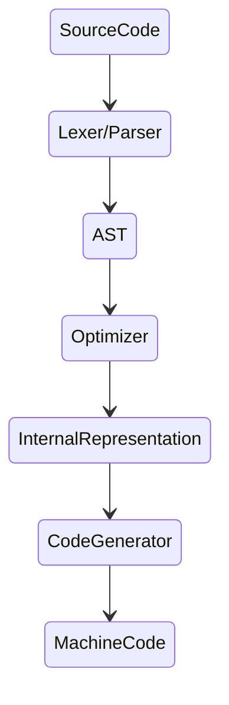

### Compiler について

ソースコードを高水準プログラミング言語から低水準言語（アセンブリ言語、オブジェクト・コード、マシン・コードなど）に変換し、実行可能なプログラムを作成するプログラム。

### 構造



**Lexer/Parser**
ソースコードをトークン化、解析して AST に変換する

**AST**
抽象構文木。プログラムの構文構造を表現する。
式 a + b * c

```
      +
     / \
    a   *
       / \
      b   c
```

何のためにあるか。意味解析の基盤になる。型チェックや関数・変数スコープの解析、識別子の解決を行いやすくする。

**InternalRepresentation**
コンパイラがソースコードを解析・変換・最適化するために使用する中間段階の表現。
ソースコードから生成され、最終的な機械語コードに変換される前に使用される。
IR は言語やプラットフォームに依存しない形式であり、コンパイラの異なるフェーズ間でのデータのやり取りを容易にする

**仮想マシン**

- スタックマシン
  - JVM. 入れ物にスタックを積んでいって、上に積む。上から取り出して入れ物に積む。Push と Pop を繰り返す。
- レジスタマシン
  - 有限個のレジスタ(入れ物)を使い、計算を行う。3つレジスタがあれば、1 + 2 = 3 のときに 1, 2 をレジスタに割り当て、3 をさらに別のレジスタに割り当てられる

マシンに必要な部品数 -- スタックマシン < レジスタマシン
必要な命令数 -- スタックマシン > レジスタマシン
パフォーマンス -- スタックマシン < レジスタマシン (命令数が少ない結果)
コンパイラの難易度 -- スタックマシン < レジスタマシン

トレードオフが発生する

なぜ必要なのか。プログラムを色々なプラットフォーム用にコンパイルするのは大変。
プラットフォームで動くようにする部分に責任をもつものを定義した。それに対してコンパイルすることでコンパイル運用コストを削減している。  

仮想マシンはバイトコードを実行する。バイトコードはマシンに何をするべきかを指示する命令で構成されている。各命令に含まれるオペコードのサイズは 1 バイト。オペコードは命令の演算子の部分。例えば、PUSH や POP など。これは 1 バイト以上だがイメージとしてそんな感じ。これらの名前はニーモニックと言われる。オペコードと人間が理解しやすい言葉とのマッピングだと理解している。これらのオペコードには引数が必要である。その引数はオペランドと呼ばれる。  
以上から、バイトコードはオペコードとオペランドがメモリ上で隣り合わせに並べられたシーケンスだと想像できる。  

ただし、バイトコードは仮想マシンに対しての機械語なので対応する仮想マシン上でしか動かない。

ちなみに、Go の場合はコンパイル時にアセンブリになりアセンブラによってバイナリになる。もう少し詳しく言うと、中間コードから各CPUに最適化されたアセンブリコードになる。