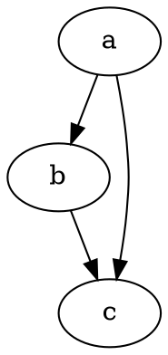

## このページについて

gatsby で運用するmarkdownでumlが描けるように拡張したしたときの手順が書いてあります


## 手順


```none
$ npm install --save gatsby-remark-mermaid gatsby-transformer-remark gatsby-remark-graphviz
```

gatsby-config.js に追記

```
{
  resolve: "gatsby-transformer-remark",
  options: {
    "strategy": "img",
    "plugins": [
      'gatsby-remark-draw',
      'gatsby-remark-mermaid',
      'gatsby-remark-graphviz'
    ]
  }
}
```

この記述が

**mermaid** だと

```
\```mermaid
graph TD;
    A-->B;
    A-->C;
    B-->D;
    C-->D;
\```
```


**graphiz** だと

```
\```dot-svg
digraph graphname {
  a -> b;
  b -> c;
  a -> c;
}
\```
```




